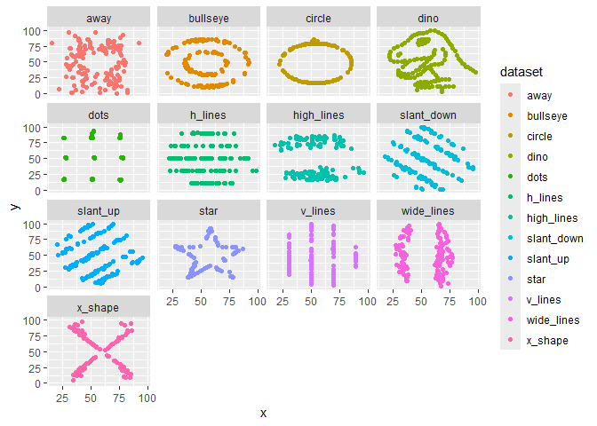
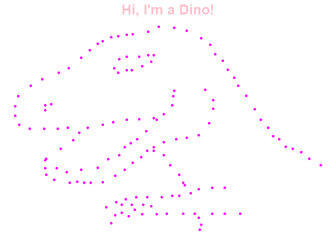

Lab1
================
Jack Sutton
2024-09-16

# Load Packages

``` r
library(haven)
library(dplyr)
```

    ## 
    ## Attaching package: 'dplyr'

    ## The following objects are masked from 'package:stats':
    ## 
    ##     filter, lag

    ## The following objects are masked from 'package:base':
    ## 
    ##     intersect, setdiff, setequal, union

``` r
library(tidyr)
library(ggplot2)
library(ggstatsplot)
```

    ## You can cite this package as:
    ##      Patil, I. (2021). Visualizations with statistical details: The 'ggstatsplot' approach.
    ##      Journal of Open Source Software, 6(61), 3167, doi:10.21105/joss.03167

``` r
library(psych)
```

    ## 
    ## Attaching package: 'psych'

    ## The following objects are masked from 'package:ggplot2':
    ## 
    ##     %+%, alpha

``` r
library(bruceR)
```

    ## 
    ## bruceR (v2024.6)
    ## Broadly Useful Convenient and Efficient R functions
    ## 
    ## Packages also loaded:
    ## ✔ data.table ✔ emmeans
    ## ✔ dplyr      ✔ lmerTest
    ## ✔ tidyr      ✔ effectsize
    ## ✔ stringr    ✔ performance
    ## ✔ ggplot2    ✔ interactions
    ## 
    ## Main functions of `bruceR`:
    ## cc()             Describe()  TTEST()
    ## add()            Freq()      MANOVA()
    ## .mean()          Corr()      EMMEANS()
    ## set.wd()         Alpha()     PROCESS()
    ## import()         EFA()       model_summary()
    ## print_table()    CFA()       lavaan_summary()
    ## 
    ## For full functionality, please install all dependencies:
    ## install.packages("bruceR", dep=TRUE)
    ## 
    ## Online documentation:
    ## https://psychbruce.github.io/bruceR
    ## 
    ## To use this package in publications, please cite:
    ## Bao, H.-W.-S. (2024). bruceR: Broadly useful convenient and efficient R functions (Version 2024.6) [Computer software]. https://CRAN.R-project.org/package=bruceR

    ## 
    ## These packages are dependencies of `bruceR` but not installed:
    ## - pacman, openxlsx, ggtext, see, lmtest, vars, phia, MuMIn, GGally
    ## 
    ## ***** Install all dependencies *****
    ## install.packages("bruceR", dep=TRUE)

``` r
library(ggsci)
library(datasauRus)
```

# First look of descriptive statistics

``` r
datasaurus_dozen %>% 
  group_by(dataset) %>%
  dplyr::summarize(mean_x    = mean(x),
      mean_y    = mean(y),
      std_dev_x = sd(x),
      std_dev_y = sd(y),
      corr_x_y  = cor(x, y)
    )
```

    ## # A tibble: 13 × 6
    ##    dataset    mean_x mean_y std_dev_x std_dev_y corr_x_y
    ##    <chr>       <dbl>  <dbl>     <dbl>     <dbl>    <dbl>
    ##  1 away         54.3   47.8      16.8      26.9  -0.0641
    ##  2 bullseye     54.3   47.8      16.8      26.9  -0.0686
    ##  3 circle       54.3   47.8      16.8      26.9  -0.0683
    ##  4 dino         54.3   47.8      16.8      26.9  -0.0645
    ##  5 dots         54.3   47.8      16.8      26.9  -0.0603
    ##  6 h_lines      54.3   47.8      16.8      26.9  -0.0617
    ##  7 high_lines   54.3   47.8      16.8      26.9  -0.0685
    ##  8 slant_down   54.3   47.8      16.8      26.9  -0.0690
    ##  9 slant_up     54.3   47.8      16.8      26.9  -0.0686
    ## 10 star         54.3   47.8      16.8      26.9  -0.0630
    ## 11 v_lines      54.3   47.8      16.8      26.9  -0.0694
    ## 12 wide_lines   54.3   47.8      16.8      26.9  -0.0666
    ## 13 x_shape      54.3   47.8      16.8      26.9  -0.0656

# Introduce GGplot

``` r
ggplot(datasaurus_dozen, aes(x = x, y = y, colour = dataset))+
    geom_point() + facet_wrap(~dataset)
```

<!-- -->

``` r
dino<- datasaurus_dozen %>%
  filter (dataset == "dino")

ggplot(dino, aes(x = x, y = y))+
    geom_point(color = "#FF00FF")+theme_void() + labs(title = "Hi, I'm a Dino!") + theme(plot.title=element_text(hjust=0.5, face="bold", size=20, color = "pink"))
```

<!-- -->

# Q1: What is the function of facet wrap? In what situation do you think you will use this function?

Facet wraps present each category as its own individual graph. We’ll use
this to separate categories of interest and group them when we want to
visualize certain relationships or variables.

# Q2: The means, standard deviations, and correlations are pretty much the same, but the data pattern looks very different for each dataset. What is the implication here?

It implies that data visualization is important to discern otherwise
similar data sets. If we hadn’t separated them with facet wrap and
visualized them, we might wrongly assume they are similar/same.
